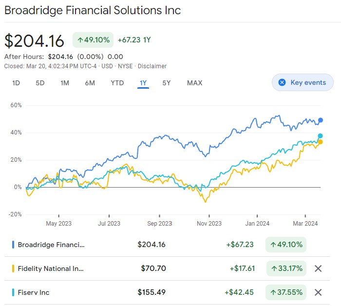

# Broadridge Financial Solutions Business Case

## Overview and Origin

###Name of company
- Broadridge Financial Solutions Inc

###When was the company incorporated?
- Began as brokerage service division of ADP in 1962.  Became independent in 2007. ADP itself started as Automatic Payrolls, Inc in 1949.

###Who are the founders of the company?
- Automatic Payrolls Inc was founded by Henry Taub in Roseland, NJ.  Frank Lautenberg, former senator from New Jersey, became a partner in 1957.

###How did the idea for the company (or project) come about?  
Like IBM, ADP rode the crest of computer automation to automate non-manufacturing business functions which had been done by hand.
Broadridge Financial Solutions focuses on automating securities processing, providing software and services to large securities firms in the US and Canada.

###How is the company funded? How much funding have they received?
Broadridge went public in 2007 and is now listed in the S&P 500.  Their shares are traded publicly, and they borrow on public markets extensively.

## Business Activities

###What specific problem is the company or project trying to solve?
Broadridge seeks to improve client revenues and reduce risk by offering tools to access market data, their own proprietary data, and make sense of it.
Recently, Broadridge sought to provide to their clients a natural language interface to the sort of data used by fixed income professionals.  

###Who is the company's intended customer? Is there any information about the market size of this set of customers?
Broadridge's customers are brokerages and other securities firms, ranging in size from medium to huge.

###What solution does this company offer that their competitors do not or cannot offer? (What is the unfair advantage they utilize?)
This solution is the first of its kind - to be used by fixed income traders, account managers and operations staff.  It is patent-pending and no doubt their competitors are hot on their heels with their own solutions.

###Which technologies are they currently using, and how are they implementing them? (This may take a little bit of sleuthing&mdash;you may want to search the company’s engineering blog or use sites like Stackshare to find this information.)
The BondGPT product is a generative LLM, built on ChatGPT-4.  The model undergoes additional domain-specific training.  A large body of bond-related data is integrated into the model.  The model can be tailored to the client needs and preferences, which influence the model's responses to user queries.  The product is integrated into Broadridge's bond trading platform.

## Landscape

###What field is the company in?
Fintech

###What have been the major trends and innovations of this field over the last 5&ndash;10 years?
Too many to count, but some are
- automated trading
- faster settlement cycles

###What are the other major companies in this field?
According to MarketBeat, top competitors include:
- FLEETCOR Technologies
- Global Payments
- WEX
- Fidelity National Information Services (FIS)
- Fiserve

## Results

###What has been the business impact of this company so far?
The business impact of the BondGPT product is not yet known.  The stock (ticker:BR) is rated a "hold" by Zack's.

###What are some of the core metrics that companies in this field use to measure success? How is your company performing based on these metrics?
Like other publicly traded companies, Broadridge measures success in terms of 
- earnings per share
- stock price
- cost of capital and related bond ratings

###How is this company performing relative to competitors in the same field?
Attached is a chart showing stock prices of Broadridge vs. two competitors for the last 12 months.

## Recommendations

###If you were to advise the company, what products or services would you suggest they offer? (This could be something that a competitor offers, or use your imagination!)
Suggest tools for internal use, such as 
- An LLM based on ChatGPT with additional training in company specific data and practices.  Sort of an assistant to the employees.  The tool would be capable of generating often-used communications using standard templates tailored to the needs of the audience
- A code and product maintenance LLM to support queries about a specific product and the code and data underlying it.  Particularly useful for products based on old mainframe code and data

###Why do you think that offering this product or service would benefit the company?
- the first is a productivity enhancer.
- The second will improve productivity, reduce risk and improve customer service to those clients who rely on the products.

###What technologies would this additional product or service utilize?
LLM, additional subject-area training.

###Why are these technologies appropriate for your solution?
These technologies are proving their worth across the spectrum of industries.